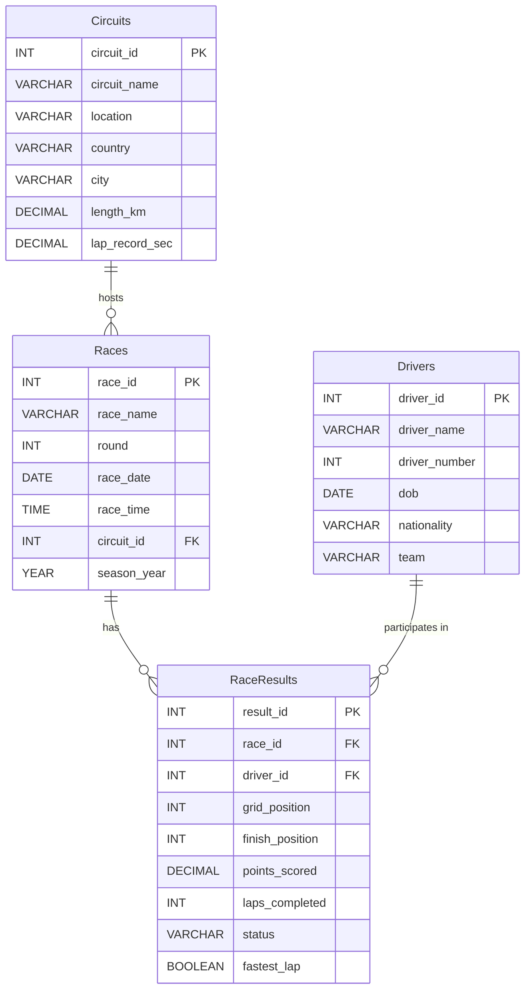

```mermaid
erDiagram
    Circuits {
        INT circuit_id PK
        VARCHAR circuit_name
        VARCHAR location
        VARCHAR country
        VARCHAR city
        DECIMAL length_km
        DECIMAL lap_record_sec
    }

    Races {
        INT race_id PK
        VARCHAR race_name
        INT round
        DATE race_date
        TIME race_time
        INT circuit_id FK
        YEAR season_year
    }

    Drivers {
        INT driver_id PK
        VARCHAR driver_name
        INT driver_number
        DATE dob
        VARCHAR nationality
        VARCHAR team
    }

    RaceResults {
        INT result_id PK
        INT race_id FK
        INT driver_id FK
        INT grid_position
        INT finish_position
        DECIMAL points_scored
        INT laps_completed
        VARCHAR status
        BOOLEAN fastest_lap
    }

    Circuits ||--o{ Races       : "hosts"
    Races    ||--o{ RaceResults : "has"
    Drivers  ||--o{ RaceResults : "participates in"
```
